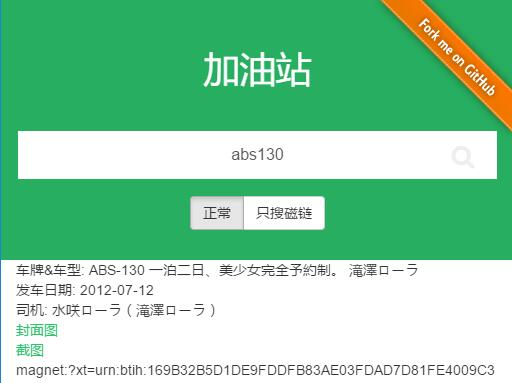

**Gas** is a JAV magnet crawler, written in PHP.

[Demo](https://gas.arukascloud.io/)

### Sources

* [javbus](https://www.javbus.com/)
* [javlibrary](http://www.javlibrary.com/)
* [torrentkitty](https://www.torrentkitty.tv/)

### Install

**Source**

1. Cloned it from github or download package as zip.
2. Unzip code to your webserver.
3. Go to //youhost.com/ and that's all <3.

**Docker**

[](https://hub.docker.com/r/hldh214/gas/)


``` sh
$ docker run -d -p 8000:80 hldh214/gas
```

### Future features


* more readable code.
* more source.

### Contribution

Feel free to contribute.

* Found a bug? Try to find it in issue tracker https://github.com/hldh214/gas/issues ... If this bug is missing - you can add an issue about it.
* Can/want/like develop? Create pull request and I will check it in nearest time! 


#### License

Gas is open-source software licensed under the MIT License. See the LICENSE.txt file for more information.